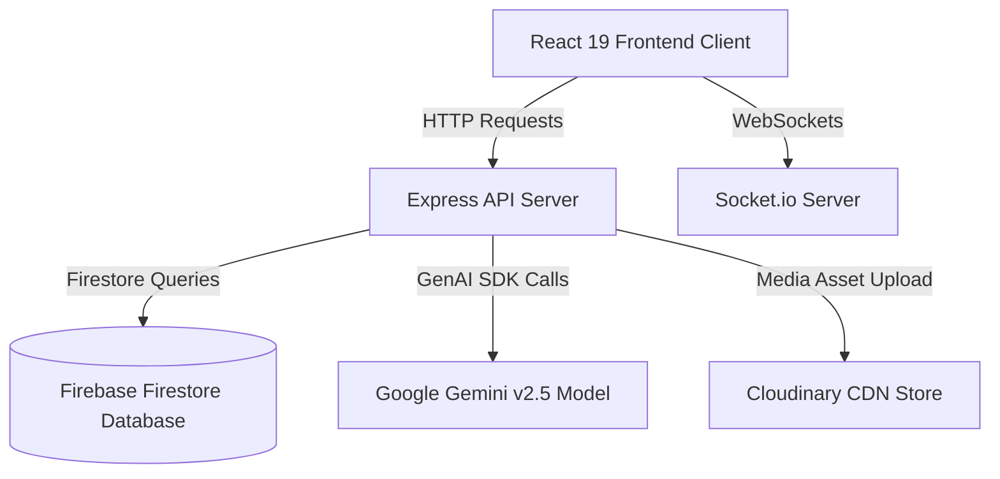

# 🏢 Hostel Hub — Smart AI-Powered Hostel Management System

A highly polished, full-stack Hostel Management System featuring real-time status updates, comprehensive analytics dashboards, integrated bookings & payments, and an automated allocation engine. The platform is enriched with a persistent, intelligent **AI Counselor (Voice/Chat Assistant)** powered by the latest Google Gemini models.

---

## 🎨 Visual Preview

<p align="center">
  
</p>

### 📱 Responsive Adaptability

Designed with a sleek **Slate-Twilight aesthetic**, the platform adapts natively across mobile viewport widths up to immersive desktop panels:
- **Mobile Responsive Drawer Layout**: A collapsed sidebar menu triggered by an elegant Hamburger button ensures desktop-grade capability stays fluid on-the-go. Includes backdrop-blur overlays (`backdrop-blur-xs`) and sliding animations.
- **Top Bar Controls**: Includes dynamic live heartbeat indicators (e.g., `● ONLINE`), notification badges, and quick profile toggles designed for seamless accessibility.

---

## 🚀 Key Features

### 🧑‍🎓 Student Dashboard
- **Room Explorer**: Visual cards depicting room categories (AC, Non-AC, Deluxe), capacity progression (e.g., `1/2 FILLED`), and pricing details.
- **Auto-Allocation system**: Formulates allocations using criteria matching (preferred flooring, AC constraints, dietary or lifestyle affinities).
- **Interactive Leave Register**: File digital leave applications with start/end details, upload supporting documents via Cloudinary, and monitor reviews.
- **Real-time Attendance Tracker**: Virtual biometric check-in and check-out logs tracking late submissions and calculating delay thresholds.
- **Direct Grievance Desk**: Issue water, electrical, cleaning, or WiFi tickets, attach media attachments, and follow the comments timeline.

### 🛡️ Warden & Admin Controller
- **Unified Analytics**: Visualize real-time charts illustrating overall occupancy percentages, collected revenue structures, pending leave forms, and open grievances.
- **Resource Administration**: Full CRUD operations to configure room rosters, modify pricing, define room features, or allocate occupants.
- **Leave & Grievance Reviews**: Authoritative action workflows to approve/reject outward leaves or assign technical staff to complaints.
- **Notification Broadcaster**: Push high-priority announcements to all occupants individually or system-wide using unified real-time socket events.

### 🤖 AI Counselor (Gemini Copilot)
- **Hostel Guidelines Assistant**: Answers questions about curfew regulations, guest limits, maintenance timelines, and general booking rules.
- **Room Affinity Recommender**: Queries students about study schedules and clean-room preferences to suggest fitting cohorts.

---

## 🛠️ Technological Architecture



### 💻 Stack Breakdown

| Technology Suite | Module Alignment | Description |
| :--- | :--- | :--- |
| **React 19 & TypeScript** | Client Interface | High-performance interactive architecture, strict prop type interfaces, and modular functional rendering. |
| **Tailwind CSS v4** | UI/Styling System | Tailored theme custom tokens, dynamic responsive classes, and beautiful utility-first UI layers. |
| **Motion** | Fluid Transitions | Provides animations for drawers sliding-in, cards fade-in, and feedback micro-interactions. |
| **Node.js, Express & tsx**| Backend Host | Handles custom API aggregation, JWT Authentication middleware, and static asset mapping. |
| **Vite** | Asset Bundler | Supercharged client development compilation engine. |
| **esbuild** | Production Bundler | Packages backend server code into a self-contained `dist/server.cjs` file to bypass EMS/CJS resolution conflicts. |
| **Google Gemini API** | AI Counselor Cognition | Driven by the official `@google/genai` modern TypeScript client SDK. |
| **Socket.io** | Live WebSockets | Distributes live notifications, status alerts, and synchronized board views to connected sessions. |

---

## 📊 Database Schemas

Our data structures are represented cleanly across Firestore collections and local database mocks. Below are the key entity references:

### `User` Table
Tracks registered members and credentials across security roles.
| Field | Type | Attributes / Constraints | Description |
| :--- | :--- | :--- | :--- |
| `id` | `string` | Primary Key, e.g. `usr_admin_1234` | Unique system identifier. |
| `name` | `string` | Required | Full name of the user. |
| `email` | `string` | Required, Case-Insensitive, Unique | Authorized contact email. |
| `role` | `'student' \| 'admin' \| 'warden'` | Default: `'student'` | Access privilege setting. |
| `phone` | `string` | Required | Active mobile number. |
| `studentId`| `string` | Optional | Mandatory for student enrollment. |
| `status` | `'active' \| 'suspended'` | Default: `'active'` | Account status controller. |

### `Room` Table
Represents living quarters and occupancies.
| Field | Type | Attributes / Constraints | Description |
| :--- | :--- | :--- | :--- |
| `id` | `string` | Primary Key | Room entry index. |
| `roomNumber`| `string` | Unique, e.g. `101`, `302` | Room labeling. |
| `capacity` | `number` | Minimum: `1` | Max permissible bed count. |
| `occupied` | `number` | Default: `0` | Active headcount matching. |
| `type` | `'AC' \| 'Non-AC' \| 'Deluxe'` | Required | Class tier category. |
| `price` | `number` | Currency base | Billing terms per slot period. |
| `floor` | `number` | Required | Floor depth placement indices. |
| `amenities` | `string[]` | Default: `[]` | Included features (e.g. WiFi, Desk, Wardrobe). |
| `status` | `'Available' \| 'Reserved' \| 'Occupied'`| Automated | Operational availability state. |

### `Payment` Table
Tracks monetary transactions.
| Field | Type | Validations | Description |
| :--- | :--- | :--- | :--- |
| `id` | `string` | Primary Key | Transaction identifier. |
| `bookingId` | `string` | Foreign Key Relation | Linked allocation reference. |
| `studentId` | `string` | Foreign Key Relation | Payer profile mapping. |
| `amount` | `number` | > 0 | Paid currency value. |
| `status` | `'Success' \| 'Failed' \| 'Pending'` | Required | Payment status state. |
| `type` | `'Admission Fee' \| 'Monthly Fee' \| 'Caution Deposit'` | Required | Purpose of the transfer. |
| `razorpayOrderId` | `string` | Unique | Transaction record indicator. |

---

## 🔌 API Route Directory

The Express server handles secure backend endpoints with custom JWT payload validation on all routes requiring authentication.

### Authentication Endpoints
- **`POST /api/auth/register`**: Registers a student, warden, or administrator.
- **`POST /api/auth/login`**: Authenticates credentials and returns an HMAC SHA-256 JWT, enabling long-lived secure sessions.
- **`POST /api/auth/google`**: Integrates third-party Google SSO and creates associated user registers.
- **`GET /api/auth/me`**: Fetches active session profile status payload. *Requires Bearer Token header.*

### Accommodations & Allocations
- **`GET /api/rooms`**: Returns the list of available rooms.
- **`POST /api/rooms`**: Admin command to register new quarters. *Requires Admin Token.*
- **`PUT /api/rooms/:id`**: Edits dimensions, facilities, or occupancy caps. *Requires Admin Token.*
- **`POST /api/rooms/auto-allocate`**: Auto-allocates an available layout based on user parameters, assigning corresponding booking orders.
- **`PUT /api/rooms/vacate/:roomId`**: Empties assigned rooms and sets status back to 'Available'.

### Administrative Records
- **`GET /api/complaints`**: Lists structural grievances. Wardens view system-wide complaints; Students view their own submissions.
- **`POST /api/complaints`**: Student registers a fresh maintenance ticket.
- **`PUT /api/complaints/:id/status`**: Updates status (`Pending` ➡️ `In Progress` ➡️ `Resolved`).
- **`GET /api/leave`**: Displays pending inward or outward leaves.
- **`POST /api/leave`**: Students submit leave requests, highlighting date parameters and digital proofs.
- **`GET /api/attendance`**: Lists historical biometric attendance check-ins.
- **`POST /api/attendance/check-in`**: Records student on-time check-in. Includes automatic late category mapping for late entries.

### AI Assistant (Gemini)
- **`POST /api/assistant/chat`**: Dispatches prompts to the Gemini model initialized on the server-side with standard rules configuration. Facilitates voice message responses or quick-tip guidelines.
- **`POST /api/assistant/recommend`**: Runs matching algorithms evaluating quiet study cycles and sleeping profiles against room configurations to supply an optimized list of recommendations.

---

## 🛠️ Configuration & Environment Setup

To synchronize keys on local or standard production builds, declare following configurations inside a `.env` file at root level:

```env
# Server Port (Mapped by Host Proxy)
PORT=3000

# Secret Core Keys
GEMINI_API_KEY=AIzaSyD_...Your_Gemini_API_Key
JWT_SECRET=hostel_jwt_ultra_secret_2026

# Third Party Storage 
CLOUDINARY_URL=cloudinary://...
```

Make sure the `.env.example` documents any new variables introduced to guide developers.

---

## 📦 Building and Executing

### Development Execution
Launches Vite in standard middleware development mode:
```bash
npm run dev
```

### Production Build Sequence
Compiles the React bundle using Vite, and packages the TypeScript server entry points using `esbuild` for speed and dependency-resolution isolation:
```bash
npm run build
```

The compiled code compiles safely inside `/dist`, with the Node backend saved under `dist/server.cjs`.

### Production Server Startup
Launches the fully compiled Express application in production mode:
```bash
npm start
```
